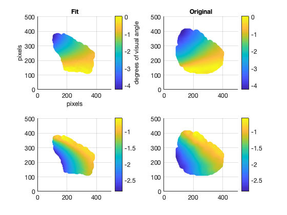
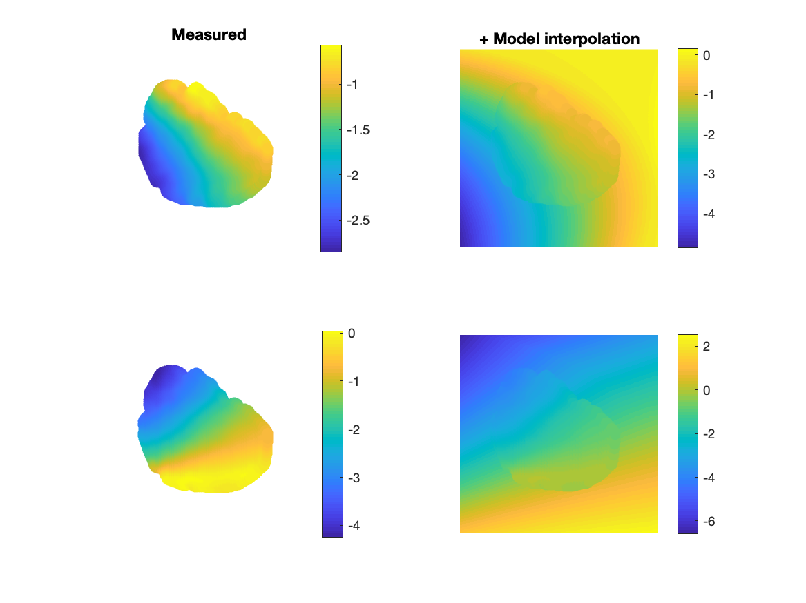

### :octopus: [giacomox - Home](https://giacomox.github.io/#/RetinoProj/README) :octopus:
# Retinotopic Map Model

This repository contains a Matlab function to generate a retinotopic model (**RetinoModel.m**),
and a function to fit the model to a real retinotopic map (**FitRetino.m**).
To see how these two functions work, I provided a Demo script (DEMO.m) and some "real" test data (**/testdata**).

In order to run the fit, you need to add to the Matlab path a library called "bads" (Bayesian minimization algorithm).
You can download this free library [here](https://github.com/lacerbi/bads).

Here you can see a preview of the figures that you will be able to generate with the demo.
* First, the projection of a simple grid in the visual space to the retinotopic map. The colors of the lines in the left panels correspond to the
colors in the right panels. The red cross in the 1st and 3rd panels corresponds to the fixation point. Please notice that the right hemisphere is represented on the left of the black line (2nd and 4th panels) and the left
one on the right. For both hemispheres the fovea is at X = 0 and Y = 0.


```Matlab
param = [A Bx By Angle U0 V0];

[x y] = RetinoModel(U,V,param)
```


<p align="center">

</p>


* Second, a visualization of the "real" retinotopic data that we are going to use to fit the model.

<p align="center">

</p>

## Model fit with real retinotopy
* Third, the results of the fit of this data with the model

```Matlab
param= FitRetino(RX,RY)
```


<p align="center">

</p>


* Now that we have "calibrated" the model by estimating the good set of parameters to reproduce the data, we can simulate the retinotopic response to any visual stimulus over the two hemispheres.
If you want to see how to project visual stimuli to the retinotopic map check this other repository.

## Model "Inversion"

$(u,v) = f_{inv}(x,y)$

```Matlab
[x y] = RetinoModel(U,V,test_param)
```

<p align="center">

</p>
## More about the model
This model takes cartesian visual coordinates as an input and returns cartesian retinotopic coordinates as an output.
