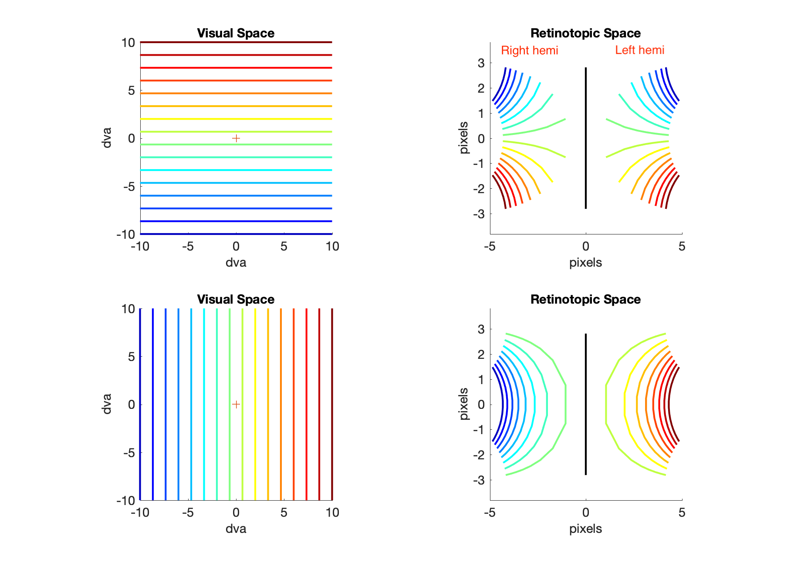
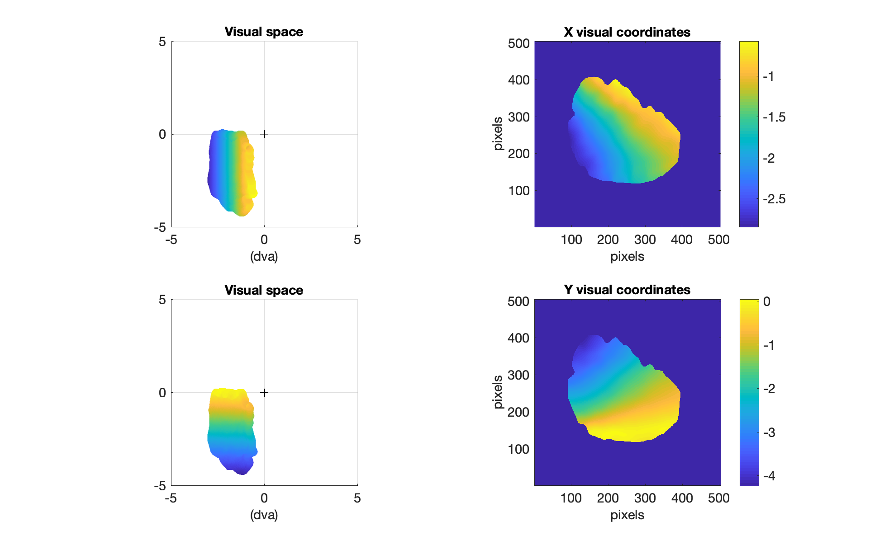

# RetinoMapModel
Simulate neuronal responses over the retinotopic map in primary visual cortex

## Model Demo
This contains a V1 retinotopic map model

*Simple grid*

\[
   \frac{1}{2}
\]

## Quick Start
1. Clone this repository and add it to Matlab path
2. Clone bads repository and add it to Matlab path
3. Set this repo as Current folder in Matlab
4. Open "DEMO.m" in Matlab, section by section (cmd+enter)
