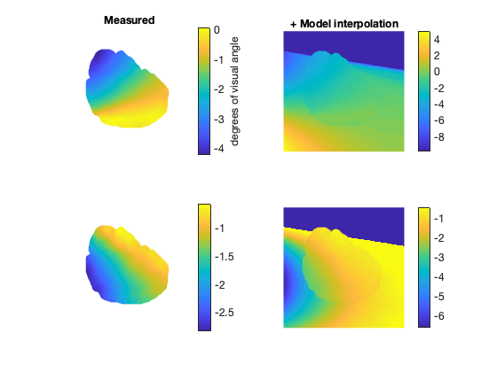

# Retinotopic Map Model
by Giacomo Benvenuti

This repository contains a Matlab function to generate a retinotopic model (**RetinoModel.m**),
and a function to fit the model to a real [retinotopic map](http://www.scholarpedia.org/article/Visual_map) (**FitRetino.m**).
To see how these two functions work, I provided a Demo script (DEMO.m) and some "real" test data (**/testdata**).

In order to run the fit, you need to add to the Matlab path a library called "bads" (Bayesian minimization algorithm).
You can download this free library [here](https://github.com/lacerbi/bads).

Here you can see a preview of the figures that you will be able to generate with the demo.
* First, the projection of a simple grid in the visual space to the retinotopic map. The colors of the lines in the left panels correspond to the
colors in the right panels. The red cross in the 1st and 3rd panels corresponds to the fixation point. Please notice that the right hemisphere is represented on the left of the black line (2nd and 4th panels) and the left
one on the right. For both hemispheres the fovea is at X = 0 and Y = 0.


```Matlab
[u v] = meshgrid(linspace(-10,10,16),linspace(-10,10,16));
param = [A Scale Bx By Angle U0 V0];
[x y] = RetinoModel(u,v,param)
```


<p align="center">

</p>


* Second, a visualization of the "real" retinotopic data that we are going to use to fit the model.

<p align="center">

</p>

## Model fit with real retinotopy
* Third, the results of the fit of this data with the model

```Matlab
param = FitRetino(RX,RY)
[x y] = RetinoModel(RX,RY,param)
```

<p align="center">

</p>


* Now that we have "calibrated" the model by estimating the good set of parameters to reproduce the data, we can simulate the retinotopic response to any visual stimulus over the two hemispheres.
If you want to see how to project visual stimuli to the retinotopic map check this other repository.

## Model "Inversion"


```Matlab
[x y] = RetinoModel_INV(u,v,param)
```

<p align="center">

</p>

## More about the model

As explained in [Taouali et al., 2012](https://link.springer.com/chapter/10.1007/978-3-642-27534-0_21) and [Taouali et al., 2015](https://github.com/taoualiw/Superior-Colliculus), this model defines a retinotopic map that corresponds to the projection of the visual field coordinates into the cortical (or collicular coordinates) accounting for **cortical magnification**(i.e., the foveal region benefits from a much higher resolution than peripheral regions and this property is preserved along the visual pathway up to early visual areas [Purves, 2004]).

To build the retinotopic map, a coordinate system is often defined in the visual field (commonly polar coordinates (ρ,φ) which characterizes a position in the visual field by its eccentricity ρ from the center of gaze and its polar angle φ with respect to the lower vertical meridian). Then, a spatial transformation -often approximated by a log-polar function- is applied to the the spherical image centered on the eye [Robinson, 1972].

Here we considered a simple model, where each cortical visual position (x,y in a cartesian space) is supposed to be connected to a single position in the visual field, with respect to a logpolar deformation, that form its receptive field assuming that the non uniformity is caused by the changing size of the receptive fields.

We used equations mapping retinotopic polar coordinates (ρ (deg),φ(rad)) onto V1 Cartesian coordinates (x (mm),y(mm)). These equations were first introduced by [Ottes et al., 1986]:


<p align="center">

</p>

It means that a cell at a given position (x,y) in the V1 map is activated by retinal cells in positions (ρ, φ) according to the given equations. One result of this deformation is that the same stimulus causes a large activation in the V1 map if it is located near the fovea and smaller activation in peripheral positions
