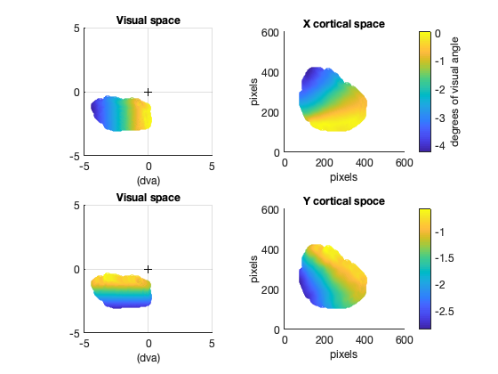

# RetinoMapModel

This repository contains a Matlab function to generate a retinotopic model (**FitRetinoModel.m**),
and a function to fit the model to a real retinotopic map (**FitRetino.m**).
To see how these two functions work, I provided a Demo script (DEMO.m) and some "real" test data (**/testdata**).

In order to run the fit, you need to add to the Matlab path a library called "bads" (Bayesian minimization algorithm).
You can download this free library [here](https://github.com/lacerbi/bads).

Here you can see a preview of the figures that you will be able to generate with the demo.
* First, the projection of a grid in the visual space to the retinotopic map.

* Second, a visualization of the real retinotopic data provided

* Third, the results of the fit of this data with the model

## About the model
This model takes cartesian visual coordinates as an input and returns cartesian retinotopic coordinates as an output.
